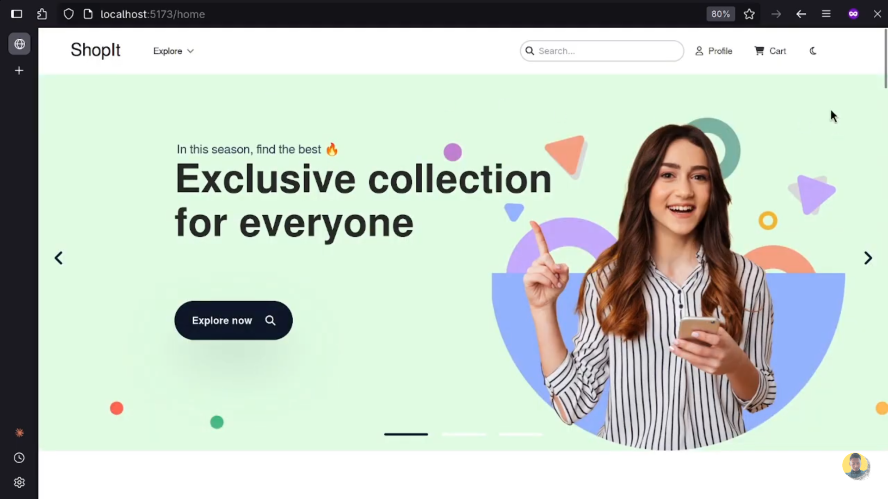
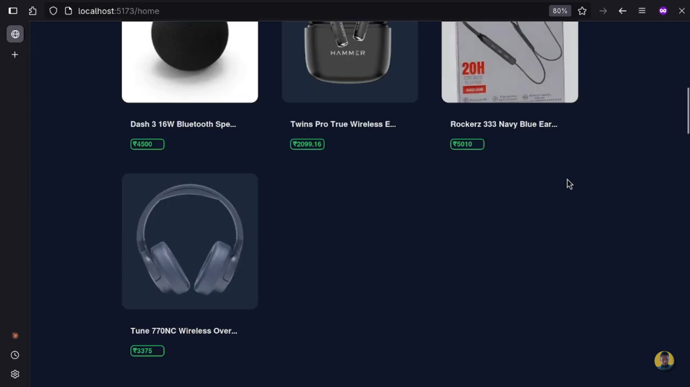

# 🛍️ ShopIt

ShopIt is a **full-stack e-commerce platform** built with modern technologies to provide a seamless shopping experience. It includes features like **user authentication, secure payments, efficient data handling, and cloud storage**.

---

## 🚀 Features

- **User Authentication** (JWT-based security)
- **Product Management** (Add, update, and delete products)
- **Payment Integration** (Razorpay for secure transactions)
- **Cloud Storage** (AWS S3 for managing product images)
- **Real-time Cache** (Redis for faster access)
- **Email & OTP Verification** (SMTP integration)
- **Dockerized Backend** (Run with Docker Compose for easy deployment)

---

## 🖥️ Tech Stack

### Frontend

- 
- 
- [Redux](https://redux.js.org/)

### Backend

- 
- 
-  for backend deployment

### Database

- 
- 

### Other Tools & Services

-  for authentication
-  for image storage
-  for payments
-  for email verification

---

## 📸 Screenshots

### 🏠 Home Page



### 🛒 Product Page



---

## 📜 Environment Variables

Create a `.env` file in the backend and add the following:

```env
SPRING_DATASOURCE_URL=your_postgresql_url
SPRING_DATASOURCE_USERNAME=your_db_username
SPRING_DATASOURCE_PASSWORD=your_db_password
SPRING_DATA_REDIS_HOST=your_redis_host
SPRING_DATA_REDIS_PORT=your_redis_port
AWS_ACCESS_KEY_ID=your_aws_access_key
AWS_SECRET_ACCESS_KEY=your_aws_secret_key
AWS_S3_BUCKET_NAME=your_bucket_name
PAYMENT_RAZORPAY_KEY_ID=your_razorpay_key
PAYMENT_RAZORPAY_KEY_SECRET=your_razorpay_secret
SECURITY_JWT_SECRET_KEY=your_jwt_secret
```

[](https://documenter.getpostman.com/view/35037237/2sB2cSh3qT)
A Postman collection containing all API endpoints is available.
